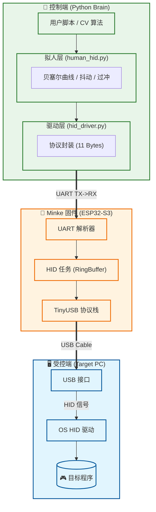

# 🐋 Minke

**Minke Is Nesting Key Events.**

> **"它安静如深海鳁鲸，却能在你按下回车的瞬间，替你掀起巨浪。"**

Minke 是一个基于 **ESP32-S3** 的微型自动化引擎。它通过 USB HID 协议将 ESP32 伪装成标准的物理键鼠设备，并通过串口（UART）接收上位机指令。

不同于传统的软件宏，Minke 实现了**硬件级隔离**与**高度拟人化控制**，支持宏录制、回放以及结合计算机视觉（CV）的闭环自动化。

---

## ✨ 核心特性

### 🛡️ 硬件级隐蔽性

* **物理伪装**: 目标电脑识别为标准 HID 设备，无需安装驱动。
* **零软件残留**: 自动化逻辑在另一台电脑运行，受控端无任何可疑进程。

### 🤖 极致拟人算法 (Human-Like)

* **贝塞尔曲线**: 摒弃机械直线，生成符合生物力学的平滑移动轨迹。
* **动态变速**: 基于菲茨定律 (Fitts's Law) 的加减速模型。
* **微观抖动**: 模拟人类肌肉的微小震颤与过冲修正 (Overshoot)。
* **随机延迟**: 基于高斯分布的按键停顿，拒绝固定频率。

### 🖱️ 双模鼠标引擎

* **相对模式 (Relative)**: 专为 FPS 游戏视角控制设计，支持高精度微操。
* **绝对模式 (Absolute)**: 专为 MOBA/桌面自动化设计，支持屏幕坐标直接映射 (0-32767)，含安全边距保护。

---

## 🏗️ 系统架构

Minke 采用 **Python 上位机 + ESP32 固件** 的双层架构，实现了决策与执行的完美分离。



---

## 🛠️ 硬件与环境

### 硬件准备

1. **ESP32-S3 开发板** (必须支持 USB OTG)。
2. **两条 USB 线**:
* **USB OTG 口**: 连接受控电脑（模拟键鼠）。
* **UART/Debug 口**: 连接控制电脑（发送指令/烧录固件）。


### 软件依赖

* Python 3.8+
* ESP-IDF v5.0+ (用于编译固件)

---

## 🚀 快速开始

### 1. 烧录固件 (Firmware)

```bash
# 进入项目根目录
cd Minke

# 设置目标芯片
idf.py set-target esp32s3

# 编译并烧录 (假设 COM3 为开发板端口)
idf.py build flash -p COM3 monitor

```

### 2. 安装 Python 驱动

```bash
# 安装依赖库
pip install pyserial pyautogui pynput

# 确认串口号 (Windows: COMx, Linux: /dev/ttyUSBx)

```

### 3. 运行第一个脚本

```python
from driver.human_hid import HumanHID

# 连接控制端串口
with HumanHID('COM3', screen_width=1920, screen_height=1080) as bot:
    print("Minke 已启动...")
    
    # 拟人化移动到屏幕中心 (带抖动和过冲)
    bot.move_to(0.5, 0.5, duration=0.8, jitter_pixels=5)
    
    # 连击操作
    bot.click('left')
    
    # 键盘宏
    with bot.hold('shift'):
        bot.type("hello minke", wpm=100)

```

---

## 📡 通信协议

Minke 使用 **11 字节定长帧** 进行高效通信。

| Header | Type | Arg1 | Arg2 | Arg3 | Arg4 | Arg5 | Arg6 | Delay_L | Delay_H | Tail |
| --- | --- | --- | --- | --- | --- | --- | --- | --- | --- | --- |
| `0xAA` | `ID` | `B1` | `B2` | `B3` | `B4` | `B5` | `B6` | `ms` | `ms` | `0x55` |

* **Type 0x01 (键盘)**: `[Keycode, Flags, Modifier, 0, 0, 0]`
* **Type 0x02 (相对鼠标)**: `[Buttons, Wheel, X_L, X_H, Y_L, Y_H]` (包含大数值拆包逻辑)
* **Type 0x03 (绝对鼠标)**: `[Buttons, 0, X_L, X_H, Y_L, Y_H]`

---

## 📂 项目结构

```text
Minke/
├── main/                  # ESP32 固件源码
│   ├── main.c             # FreeRTOS 任务入口
│   ├── usb_descriptors.c  # HID 描述符定义 (PID/VID)
│   └── protocol/          # UART 协议解析
├── driver/                # Python 上位机驱动
│   ├── hid_driver.py      # 底层通信封装
│   ├── human_hid.py       # 拟人化算法层 (贝塞尔/Fitts)
│   ├── recorder.py        # 动作录制工具
│   └── replayer.py        # 动作回放工具
├── CMakeLists.txt         # 构建脚本
└── README.md              # 说明文档

```

---

## 📼 录制与回放

Minke 内置了强大的宏录制系统，支持将操作保存为 `.jsonl` 文件。

**录制操作：**

```bash
# 运行后按 F12 停止录制
python driver/recorder.py
# 输出文件: actions.jsonl

```

**回放操作：**

```bash
# 支持倍速回放 (speed=2.0)
python driver/replayer.py

```

---

## ⚠️ 免责声明

本项目仅供技术研究与教育用途（如自动化测试、辅助功能开发）。
请勿将本项目用于违反游戏服务条款（ToS）的行为。开发者不对因使用本项目导致的账号封禁或法律后果承担任何责任。

---

**Made with  by Minke**